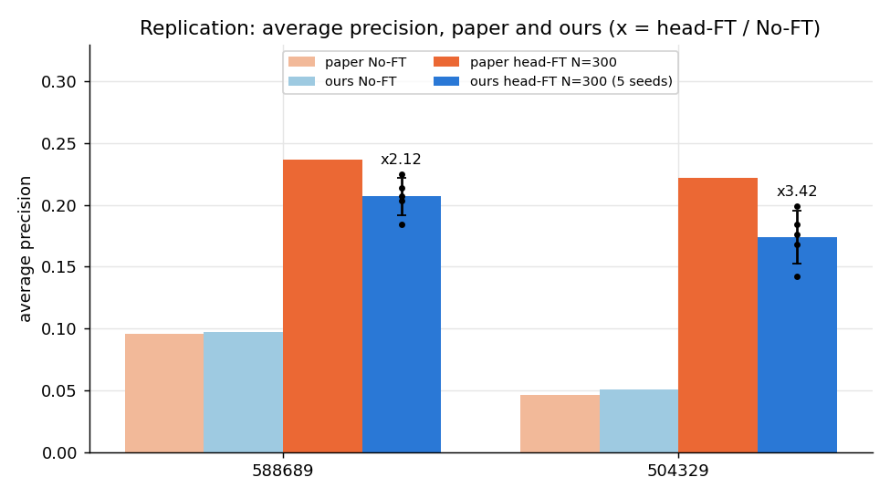
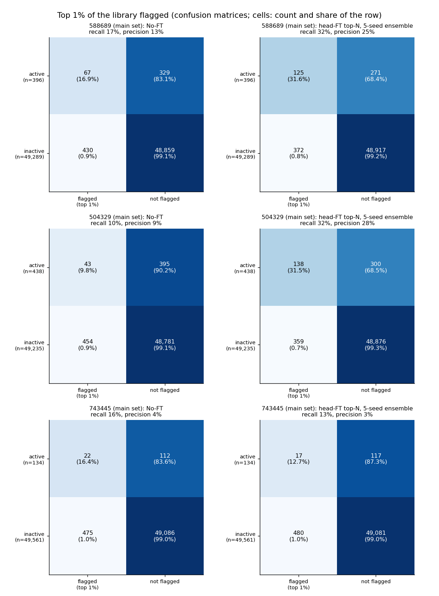
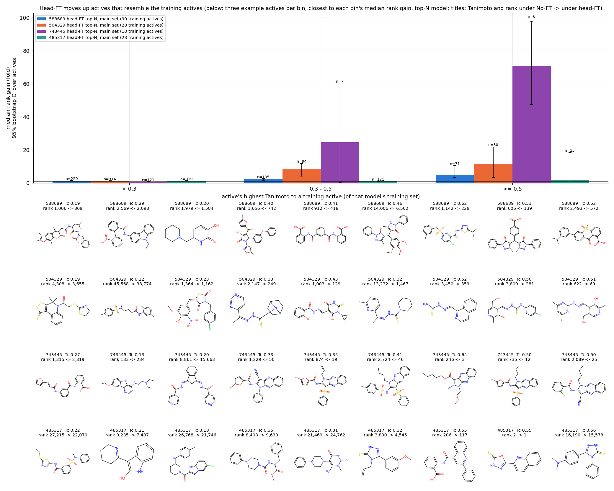
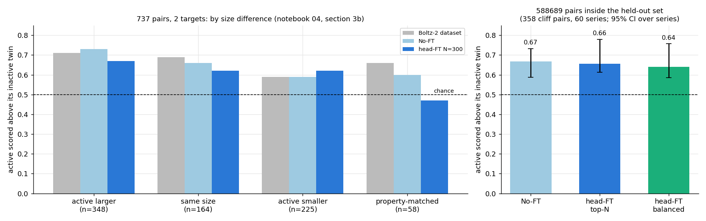
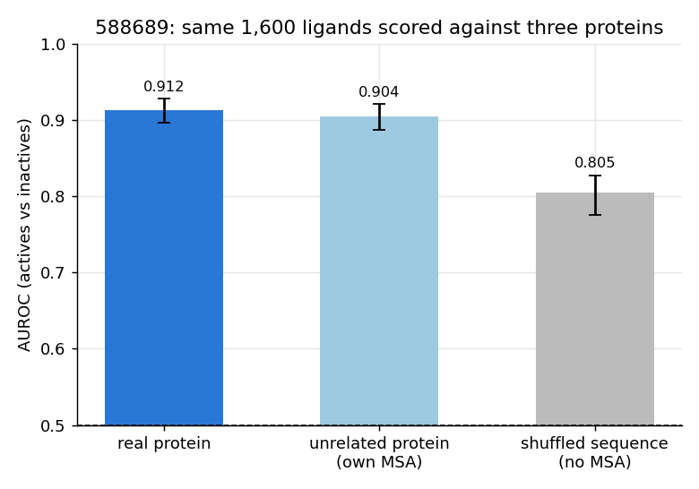
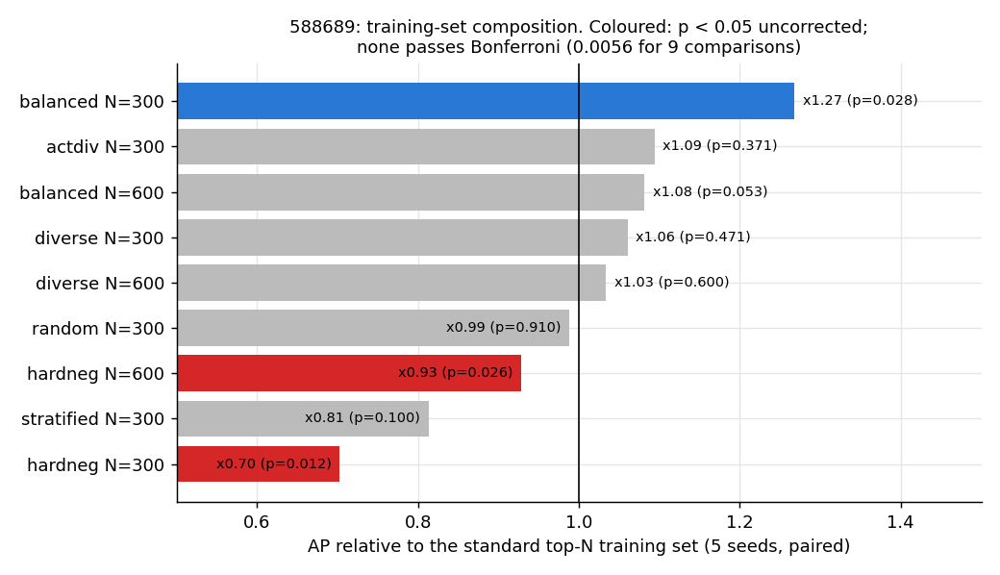
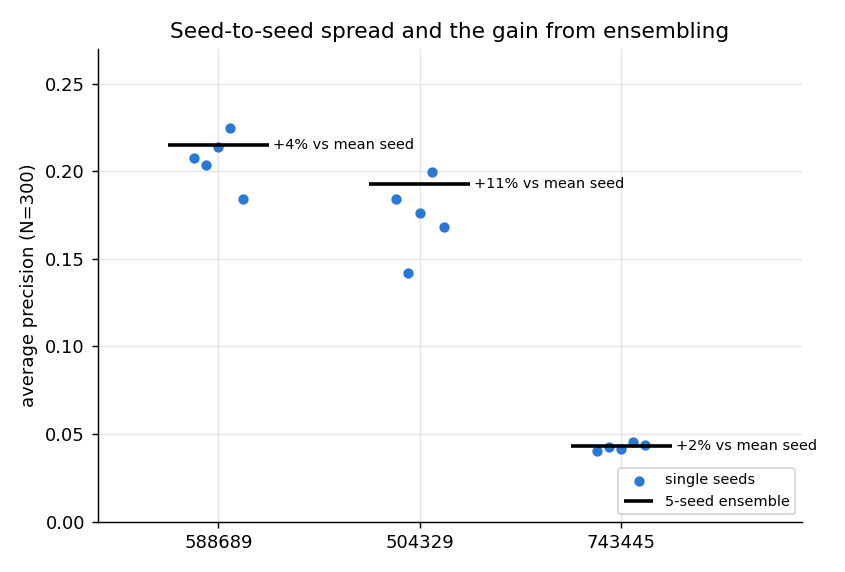
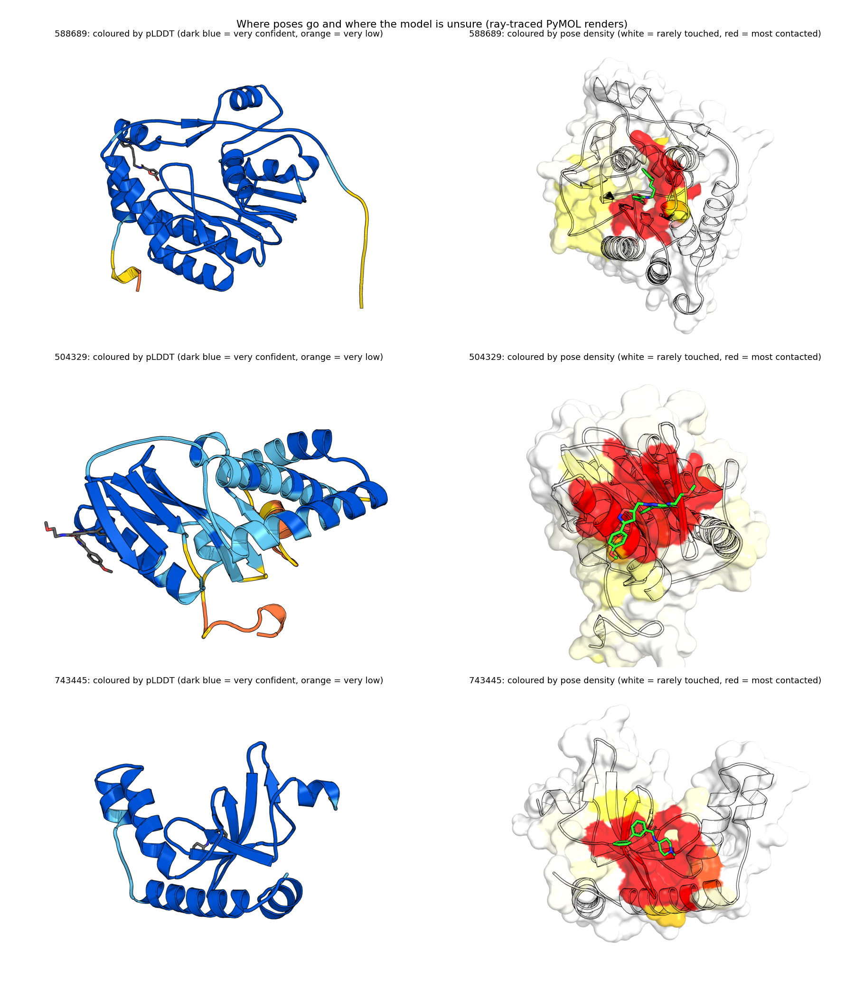

# BoltzFT reproduction — head-FT virtual screening

Reproduction of Furui & Ohue, [_Adapting Boltz-2 with limited experimental activity data improves early enrichment in virtual screening_](https://arxiv.org/abs/2609.24302) (arXiv:2609.24302), head fine-tuning result (Table 2 / Fig 2), on the Savio cluster, using the authors' released pipeline [`ohuelab/BoltzFT`](https://github.com/ohuelab/BoltzFT).

## Findings (status 2026-10-05: 6 of 8 targets finished: 588689, 504329, 743445, 485317, 2097 and 493091)

Every claim is computed in the notebooks (`notebooks/00`-`07`) and says which targets it rests on. Only **six targets** are finished (2650 and 588549 are still folding), so cross-target
statistics are weak (with 6 targets the sign test can only just reach p < 0.05; its minimum is 0.031, reached when all six improve): read each finding as "holds for these six" until the other two are in. Balanced-training arms exist for 588689 only. The figures are regenerated by
`pipeline_local/make_readme_figures.py`.

### 1. Head-FT replicates in direction on all six finished targets, with a smaller effect than the paper's on five of them
- Average precision (AP), 5 seeds, N=300 labels.
- 588689: No-FT 0.097 (paper 0.096), head-FT 0.207 +/- 0.015, x2.12 (paper x2.46).
- 504329: No-FT 0.051 (paper 0.047), head-FT 0.174 +/- 0.021, x3.42 (paper x4.76).
- 743445: No-FT 0.022 (paper 0.022), head-FT 0.043 +/- 0.002, x1.92 (paper x2.17). Odd: N=40 (whose 40 training compounds contain no actives) scores highest (0.045, x2.01), above N=100 (0.036) and N=300; cause untested.
- 485317: No-FT 0.039 (paper 0.036), head-FT 0.054 +/- 0.002, x1.39 (paper x1.67); N=40 0.045 (x1.15) and N=100 0.042 (x1.09), so the gain appears only at N=300.
- 493091: No-FT 0.059 (paper 0.059), head-FT 0.095 +/- 0.008, x1.63 (paper x1.60), the closest match to the paper of the five; N=40 x1.16 and N=100 x1.31.
- 2097: No-FT 0.098 (paper 0.081), head-FT 0.226 +/- 0.011, x2.30 (paper x3.53), the largest gap to the paper of the six; N=40 x1.05 and N=100 x1.33. Its training sets are 60%, 52% and 36% actives (N=40, 100, 300), against 0.84% in the evaluation set.
- Across the 6 finished targets: geometric-mean AP ratio at N=300 is x2.04 (95% t-interval 1.47-2.83; the paper on the same 6 targets x2.49, on all 8 x2.14); improved on 6 of 6, sign test p = 0.031 (its minimum with 6 targets).
- The dataset's shipped No-FT scores reproduce the paper's No-FT values on all 8 targets (same eval-set size and active count, AP within 0.005). That checks the evaluation, not our own Boltz-2 runs.
- Balanced training (588689 only, right panel; held-out compounds ranked below 1000, n = 48,985, 302 actives, so No-FT, top-N and balanced are scored on the same compounds): No-FT 0.058, head-FT top-N 0.155 +/- 0.021 (x2.66), head-FT balanced 0.195 +/- 0.007 (x3.35). Balanced is x1.27 over top-N (paired p = 0.028, uncorrected) and its seeds agree about three times more tightly (SD 0.007 against 0.021).
- Notebooks: `01_replication`, `00_overview`, `06_training_strategies`.



### 2. At the top 1% of the library, head-FT finds more actives on five of six targets, not on 743445
- 497 compounds flagged per target. Confusion matrices below (rows: truth; columns: flagged or not).
- 588689: 125 actives found against 67 for No-FT (recall 32% against 17%), 372 false positives against 430.
- 504329: 138 actives against 43 (recall 32% against 10%), 359 false positives against 454.
- 743445 (497 compounds flagged, 134 actives): head-FT finds fewer actives than No-FT, 17 against 22 (recall 13% against 16%), with 480 false positives against 475. Its AP still rises (x1.92), so the gain is below the very top of the ranking. Other budgets: N=40 finds 23, N=100 finds 27; per-seed N=300 finds 16-19. The top-1% result is therefore target-dependent, with 1 of 3 targets reversed.
- 485317 (497 compounds flagged, 953 actives): head-FT finds 64 actives against 39 for No-FT (recall 7% against 4%), 433 false positives against 458. N=40 finds 48 and N=100 finds 47; per-seed N=300 finds 54-61.
- 493091 (497 compounds flagged, 739 actives): head-FT finds 94 actives against 57 for No-FT (recall 13% against 8%), 403 false positives against 440. N=40 finds 65 and N=100 finds 87; per-seed N=300 finds 78-94.
- 2097 (496 compounds flagged, 415 actives): head-FT finds 114 actives against 80 for No-FT (recall 27% against 19%), 382 false positives against 416.
- Balanced training (588689 held-out set, 490 compounds flagged; not in the figure): No-FT 45 actives (recall 15%), top-N 94 (31%), balanced 100 (33%); false positives 445, 396 and 390. At the top 1% balanced is almost the same as top-N (+6 actives, no interval computed), so its AP advantage does not come from the very top of the ranking.
- At the default p > 0.5 threshold head-FT looks conservative (588689: flags 200 compounds against 2,062). That is a threshold effect from its lower probabilities, not a worse ranking.
- Notebook: `03_ft_vs_noft_reranking`.



### 3. On five of six targets the gain is concentrated in actives that resemble the training actives
- Held-out actives binned by their highest ECFP4 Tanimoto to a training active. Below 0.3: no net lift. 0.3-0.5 and above 0.5: promoted strongly.
- Median rank gain: 588689 x2.2 and x5.0; 504329 x8.2 and x11.4 (below 0.3: about x1.2 in both).
- Inactives show almost no such trend (Spearman 0.07-0.12, against 0.31-0.53 for actives).
- On 588689 the net top-1% change hides 704 compounds changing status: 76 actives promoted, 18 lost, 334 false positives removed, 276 created. The new false positives include inactive members of the same families.
- A no-training baseline (rank by Tanimoto to the nearest training active) reaches AP 0.166 on 588689, against 0.207 for head-FT.
- 743445 (only 10 training actives, so bins are small): below 0.3, n = 121, median rank change x0.6 (actives move down); 0.3-0.5, n = 7, x25; above 0.5, n = 6, x71. Spearman 0.28 for actives against 0.16 for inactives. Same direction, but the 0.3+ bins hold 13 actives.
- 493091 (43 training actives) shows it more weakly: below 0.3, n = 508, median rank change x1.1; 0.3-0.5, n = 191, x1.8; above 0.5, n = 40, x2.0; Spearman 0.28 for actives against 0.17 for inactives.
- 2097 (107 training actives) shows it clearly: below 0.3, n = 178, median rank change x0.76 (actives move down); 0.3-0.5, n = 100, x0.92; above 0.5, n = 137, x2.66 (95% interval 1.16-5.51); Spearman 0.32 for actives against -0.09 for inactives.
- 485317 (23 training actives) is the exception: below 0.3, n = 819, median rank change x1.2; 0.3-0.5, n = 121, x0.9; above 0.5, n = 13, x1.8; Spearman 0.02 for actives and 0.08 for inactives. There is no similarity dependence here, and its AP gain is the smallest of the four (x1.39).
- The balanced model shows the same dependence (588689 held-out set; not in the figure, median rank gain below 0.3: x1.0; 0.3-0.5: x2.7; above 0.5: x10.8; top-N: x1.2, x2.7, x10.6), even though its training set holds 150 actives instead of 90. Balancing does not remove the reliance on analogs of the training actives.
- Reading: on 588689, 504329, 743445, 2097 and (weakly) 493091 head-FT behaves like generalisation to analogs of the 300 labels, not like a model that has learned binding in general; 485317 does not show it. Correlational; 504329, 743445, 485317 and 493091 have only 28, 10, 23 and 43 training actives (588689 and 2097: 90 and 107).
- Figure: bars are the median rank gain per bin with a 95% bootstrap interval over actives (the intervals for 743445's bins above 0.3 are very wide, 6-7 actives each); three example actives per bin (closest to each bin's median rank gain, not cherry-picked), with Tanimoto and rank gain.
- Notebook: `03_ft_vs_noft_reranking`.



### 4. Head-FT does not tell near-identical molecules apart any better than No-FT, and balanced training does not change that
- Pairs with ECFP4 Tanimoto >= 0.6, one active and its twin inactive: 3,082 pairs in 994 chemical series, 6 targets (588689, 504329, 743445, 485317, 2097, 493091). Intervals resample chemical series (one series made 62% of 588689's pairs and 44% of 2097's).
- The active is scored above its inactive twin in 66% of pairs for No-FT and 64% for head-FT (average over targets; difference -0.018, 95% CI -0.045 to +0.019; chance is 50%). Without each target's dominant series: 67% and 67%.
- Most twins get almost the same score: at Tanimoto >= 0.7, 769 of 879 pairs are near-ties under the dataset's Boltz-2 score (787 of 879 for head-FT). A fine-tuned model moves a whole series up together.
- Right calls go with a more lipophilic, heavier active (median +0.20 logP and +10 Da, against 0.00 and 0 for ties); the heavy-atom difference itself is not distinguishable (p = 0.25). In pairs matched on size and logP (223 pairs) head-FT is at 0.56 and No-FT at 0.62.
- Balanced training (588689 only, 358 cliff pairs in 60 series inside the held-out set): the active is above its twin in 67% of pairs for No-FT, 66% for top-N and 64% for balanced; balanced minus top-N is -0.017 (95% CI -0.081 to +0.021). Share of cliffs detected at 90% specificity (threshold from both-active pairs): 0.15, 0.11 and 0.15; balanced minus top-N +0.045 (-0.006 to +0.245).
- By pair type, balanced is best when the active is the larger twin (0.75 against 0.72 for No-FT and 0.73 for top-N, n = 182) and at chance when it is smaller (0.50, n = 84) or the pair is size-matched (0.46, n = 28; top-N 0.43, No-FT 0.61): it leans on size at least as much as the others.
- So balanced training's AP gain does not extend to near-identical pairs. One target, wide intervals: an absence of evidence of a difference.
- Notebook: `04_structural_cliffs` (Parts C and C2).



### 5. The ranking is largely protein-independent on the one target tested
- Decoy rescore on 588689: the same 1,600 ligands (396 active, the rest a random sample of inactives) scored against three proteins.
- AUROC: real protein 0.912, unrelated protein (target 493091, own MSA) 0.904, shuffled sequence with no MSA 0.805.
- Real minus unrelated is +0.008 and the interval includes zero.
- So the ranking here comes mostly from the ligand. This benchmark does not show protein-aware scoring; it does not show the head cannot use the protein.
- Only the stock Boltz-2 affinity head was run on the decoys; the fine-tuned heads (top-N or balanced) were not, so whether fine-tuning changes the protein dependence is untested (it needs new inference on the decoy complexes).
- Not tested: whether the ligand signal is memorised chemotypes or general ligand properties, and any other target.
- Notebook: `05_pose_density_and_decoy`.



### 6. Training-set selection (588689 only, 70 arms, 5 seeds each): balanced helps, hard negatives hurt, budget saturates at N=300
- Balanced set (half actives, random inactives): AP x1.27 over the paper's naive top-N (paired p = 0.028; x1.08 at N=600).
- Hard negatives hurt: x0.70 (p = 0.012). Balanced beats hard-negative 0.195 to 0.108 in 5 of 5 seeds, because pushing high-scoring decoys down also demotes true actives.
- Top-scored actives against scaffold-diverse ones: borderline (0.195 against 0.170, paired t p = 0.044, Wilcoxon p = 0.062).
- N=600 and N=1000 are no better than N=300 (not detected with 5 seeds, not proof).
- 9 comparisons were made (Bonferroni threshold 0.0056) and none passes, so these are suggestive.
- Bottom line on 588689: balanced is the best of the strategies tested for AP and for seed-to-seed stability, but not at the top 1% and not for twins (findings 2-4), and none of the comparisons survives the multiple-comparison correction.
- Untested on any other target (the balanced arms for 504329 would need about 60 GPU-hours). 504329's candidate pool has 85 actives (588689: 184), so the same design would not give the same balance.
- Notebook: `06_training_strategies`.



### 7. Seed spread is small and ensembling the five seeds helps a little; uncertainty measures are diagnostic, not a screening lever
- Single-seed AP at N=300 varies by 7% (588689), 12% (504329), 5% (743445), 4% (485317), 5% (2097) and 8% (493091) around the mean (SD / mean).
- The 5-seed ensemble's AP is 4%, 11%, 2%, 3%, 2% and 6% above the average single seed. Sampling of the evaluation compounds is a bigger source of uncertainty than the seeds on five of six targets, all but 504329 (bootstrap SD of the ensemble AP 0.020 against seed SD 0.015 on 588689, 0.022 against 0.011 on 2097).
- No uncertainty measure is a reliable screening filter (six targets). At matched score the confident half of the picks (low cross-seed SD) has a LOWER active rate on 4 of 6 targets and a higher one on none (pooled risk ratio 0.74, 95% t-interval 0.61-0.91). Two-head disagreement is mixed (pooled 1.32, interval 0.92-1.90); pose confidence exists for 588689 only and shows no effect (1.04).
- The top-1% shortlists of different seeds overlap with mean pairwise Jaccard 0.55-0.70 (0.005 expected by chance), but seed-unanimous picks are no more precise than a score-ranked list of the same size on any of the six targets (precision difference -0.024 to +0.016, all intervals include 0).
- Calibration: head-FT cuts the calibration error by 0.10-0.27 against No-FT, but its mean predicted probability (0.04-0.10) is still 2.5-14 times the true active rate and its Brier score is worse than predicting the base rate on all six targets.
- Uncertainty and similarity to the training set: no meaningful relationship. The partial rank correlation of cross-seed SD with the Tanimoto to the nearest training compound, with the score removed, is between -0.06 and +0.04 (SD falls with similarity on 588689, 2097 and 493091, rises on 504329, 743445 and 485317) and the No-FT control moves by similar amounts, so similarity is not an applicability domain for the seeds. Similarity does track correctness: on 2097 87 of 114 head-FT top-1% picks (76%) with Tanimoto >= 0.5 to a training active are active against 10 of 266 (4%) below 0.3, and No-FT shows the same pattern (52 of 79, 66%, against 16 of 297, 5%).
- Notebook: `02_uncertainty`.



### 8. Poses localise to one confidently predicted pocket; the low-confidence residues are elsewhere
- A small set of residues takes almost all the contacts: the top 10% of residues carry 94% of all pose contacts on 588689 and 74% on 504329.
- 11 residues (4%) on 588689 and 12 (5.5%) on 504329 are touched in at least half of the library's poses. They are confidently predicted: mean pLDDT 97.8 and 95.0, against 94.0 and 81.1 for the other residues.
- 743445: the top 10% of residues carry 93% of contacts; 13 residues (9.2%) are touched in at least half of poses (mean pLDDT 96.8 against 95.3 for the rest); no residue is below pLDDT 50.
- 485317: the top 10% of residues carry 76% of contacts; 16 residues (11.5%) are touched in at least half of poses (mean pLDDT 94.0 against 88.2 for the rest); no residue is below pLDDT 50.
- 493091: the top 10% of residues carry 94% of contacts; 14 residues (7.8%) are touched in at least half of poses (mean pLDDT 95.6 against 97.3 for the rest); no residue is below pLDDT 50.
- 2097: the top 10% of residues carry 99% of contacts; 19 residues (4.5%) are touched in at least half of poses (mean pLDDT 95.6 against 87.0 for the rest); 41 residues (9.8%) are below pLDDT 50 and 2 of them are touched in 10% or more of poses.
- Low-confidence residues (pLDDT < 50: 2 on 588689, 22 on 504329) are mostly not where poses go: 0 and 1 of them are touched in 10% or more of poses. Across all 8 targets 87% of residues below pLDDT 50 sit at the chain termini.
- The correlation between pLDDT and pose contact per residue is weak (Spearman 0.11 and -0.16 on 588689 and 504329; -0.13 on 2097).
- Figure: reference structures coloured by pLDDT (left) and by pose density (right), ray-traced PyMOL renders.
- Same localisation under No-FT and head-FT, by construction: poses come from the frozen structure model and Pass-2 reuses them, so a compound's pose is identical under both. What differs is which compounds each model ranks on top. Per-residue contact profiles of the top 1% of each model correlate at Spearman 0.87-0.96 across the six targets, so both point at the same pocket. On 588689, 504329 and 493091 head-FT's top 1% puts less of its contacts on the most-contacted residues (56% against 67%, 56% against 66% and 81% against 89% for No-FT; library 71%, 65% and 88%); on 743445, 485317 and 2097 there is no difference (87%, 87% and 84% against 88%, 83% and 85%; library 88%, 83% and 86%).
- Caveats: pLDDT is averaged over about 400 sampled poses and the density map is from one reference prediction; both are Boltz-2's own output, not experimental data.
- Notebooks: `05_pose_density_and_decoy`, `07_structure_confidence`.



### 9. No data leakage between training and evaluation; the gain shrinks when analogs of the training compounds are removed
- Checked on all 6 finished targets (`pipeline_local/leakage_check.py`, results in `results/analysis/leakage_checks.csv`):
  - The top-40, top-100 and top-300 training sets overlap the evaluation set in 0 compounds (and are nested), and the 20 validation compounds are not in any training set.
  - 0 evaluation compounds have the same canonical SMILES (stereo removed) as a training compound.
  - Near-duplicates are very rare: 0.01-0.09% of evaluation compounds have ECFP4 Tanimoto >= 0.8 to a training compound, and 0.26-0.66% have >= 0.6.
- From the code, not tested here: the checkpoint evaluated is the final one (`last.ckpt`), so no model is selected on held-out data; the hyperparameters are the authors' fixed values; the 20 validation compounds are the last 20 evaluation ids and only feed a logged validation loss. The pre-trained Boltz-2 weights themselves may have seen these public compounds, which cannot be checked.
- Leakage-controlled metric: head-FT / No-FT AP ratio at N=300 on the evaluation compounds that are not close to any training compound.

| Target | all evaluation compounds | Tanimoto < 0.6 to every training compound | Tanimoto < 0.4 |
|---|---|---|---|
| 588689 | x2.12 | x2.03 | x1.28 |
| 504329 | x3.42 | x3.26 | x2.25 |
| 743445 | x1.92 | x1.62 | x0.97 |
| 485317 | x1.39 | x1.38 | x1.34 |
| 493091 | x1.63 | x1.47 | x1.25 |
| 2097 | x2.30 | x1.38 | x0.78 |

- Removing only the near-analogs (>= 0.6) barely changes the ratios on five targets, so the gain there is not memorised near-duplicates. 2097 is the exception: the 265 evaluation compounds (0.53%) with Tanimoto >= 0.6 to a training compound hold 95 of its 415 actives (23%), and without them the ratio falls from x2.30 to x1.38.
- Removing everything within 0.4 cuts the ratios sharply (743445 falls to x0.97, 588689 to x1.28, 2097 to x0.78, below No-FT on its 199 remaining actives), which matches finding 3: much of the gain comes from compounds that resemble the training set at moderate similarity. That is analog generalisation, which the paper's setup allows, but it means the headline ratio overstates what to expect for chemically unrelated compounds. 485317 is the exception, with a gain that does not depend on similarity.

**Caveats that apply throughout:**
- Six of eight targets finished (2650 and 588549 are still folding).
- 2097: 28 of 49,915 library compounds were never fully folded (no affinity-ready pose) and are not scored; the evaluation set is 49,587 compounds (415 actives).
- The paper trained each condition once (we use 5 seeds).
- Pair-level intervals resample chemical series, not pairs.
- The binary label is the only ground truth (no potency labels exist).
- Pipeline, run instructions and the older controls-and-caveats notes: `docs/PIPELINE_NOTES.md`.

---

## Pipeline progress

<!-- PROGRESS:START -->
Pipeline progress as of 2026-10-05 22:44: 6 of 8 targets finished; 20 GPUs running.

| Target | Library | Pass-1 folded | Pass-2 cached | Scored arms | Table 2 | Stage | Tasks running / pending (held) |
|---|---|---|---|---|---|---|---|
| 588689 | 49,985 | 49,985 (100%) | 49,985 (100%) | 16/16 | yes | done | 0 / 0 |
| 504329 | 49,982 | 49,973 (100%) | 49,973 (100%) | 16/16 | yes | done | 0 / 0 |
| 743445 | 49,995 | 49,995 (100%) | 49,995 (100%) | 16/16 | yes | done | 0 / 0 |
| 485317 | 49,980 | 49,976 (100%) | 49,976 (100%) | 16/16 | yes | done | 0 / 0 |
| 2097 | 49,915 | 49,889 (100%) | 49,887 (100%) | 16/16 | yes | done | 0 / 0 |
| 493091 | 49,985 | 49,985 (100%) | 49,985 (100%) | 16/16 | yes | done | 0 / 0 |
| 2650 | 49,882 | 33,654 (67%) | 0 (0%) | 0/16 | no | Pass-1 running | 4 / 0 |
| 588549 | 49,987 | 22,770 (46%) | 0 (0%) | 0/16 | no | Pass-1 running | 16 / 13 |

Regenerate with `python pipeline_local/progress.py --readme`.
<!-- PROGRESS:END -->

---

## Directory layout

```
boltzaff/
├── README.md                 ← this file
├── env.sh                    ← `source env.sh [TARGET]` sets all paths/env vars
├── BoltzFT/                  ← cloned pipeline + eval + data/splits + patch
├── Boltz2_affinity/          ← fork @ bc06a0b + BoltzFT patch applied (editable install)
├── boltz_cache/              ← symlinks to weights + CCD mols (+ downloaded mols.tar)
├── data/                     ← raw CSVs, cleaned *_results.csv, *_seq.txt, *_msa.csv, 3EVG.cif
├── pipeline_local/           ← our added scripts (MSA gen, seed wrappers, multi-seed eval, prep)
├── slurm/                    ← sbatch templates + logs + monitors
├── notebooks/                ← 00_data_cleanup / 00_data_stats / 00_data_prep (executed)
└── results/runs/<TARGET>/    ← per-target artifacts (inputs, chunks, poses, caches, scores)
```

**Environment:** conda env `boltzft` (clone of `boltzba` + `pip install -e Boltz2_affinity --no-deps`).
The fork supplies the custom `boltz predict` flags the pipeline needs
(`--write_embeddings_cropped`, `--skip_affinity_prediction`, `--write_affinity_embeddings_cropped`,
`--affinity_skip_run_structure`, `--reuse_pre_affinity_dir`) — stock boltz lacks them.

**SLURM:** account `co_nilah`, partition `savio3_gpu`, QOS `savio_lowprio`, `--gres=gpu:1`.
Nodes **n0143/n0144 are excluded** (their GPUs fail every job at CUDA init).

---

## Data & provenance

Compound sets + binary labels + cached Boltz-2 scores come from `mf-pcba_test.zip`
(Boltzina v1.0.1 release). Construct sequences are **not** distributed; we reconstructed them:

| Target folder | Protein | Source | Construct len |
|---|---|---|---|
| 588689 | Dengue-2 NS5 MTase | PDB 3EVG | 275 |
| 540297-493091 | SCP1 phosphatase | PDB 3PGL | 180 |
| 434954-2097 | GSK-3β | PDB 1J1B | 420 |
| 463203-2650 | GSK-3α | PDB 7SXF | 345 |
| 493248-485317 | ALR / GFER oxidase | PDB 3MBG | 139 |
| 504329 | Influenza A NS1 | predicted (NCBI GI 227977143) | 219 |
| 624273-588549 | M.tb FadD28 ligase | predicted (NCBI GI 1781172) | 580 |
| 1053173-743445 | NSD2 PWWP1 domain | PDB 6UE6 | 141 |

**Validation:** all 8 targets reproduce the paper's Table 1 (neval, eval actives, train actives at
N=40/100/300) exactly, and 2 PDB assignments were cross-checked against PubChem BioAssay targets.
**Caveat:** exact constructs (esp. His-tag boundaries / predicted-target truncations) are best
reconstructions — a fidelity note, not a validated match. MSAs are generated per target via the
colabfold MMseqs2 server and shared across that target's compounds.

**Cost reality:** Pass-1 co-folding ≈ **26 s/compound** → **~360 GPU-h per target** for the full
~50k-compound eval set. This is *fixed per target* — independent of seed count and N budget (the
embedding cache is shared). Fine-tuning itself is trivially cheap.

---

## Pipeline (annotated steps)

Run per target. `source env.sh <TARGET>` first (sets `$R`, `$BOLTZFT`, `$WORKDIR`, etc.).

1. **Clean data** — map raw columns to the BoltzFT schema (`target_active_v2`→`Active_v2`,
   `score_boltz2`→`affinity_probability_binary`). → `data/<TARGET>_results.csv`
   *(all 8 done; see `pipeline_local/setup_targets.py`)*
2. **MSA** — `pipeline_local/gen_msa.py` → `data/<TARGET>_msa.csv` (boltz `key,sequence` format).
3. **Select subsets** — `BoltzFT/pipeline/select_subsets.py` → nested top-40/100/300 + eval subset.
4. **Build inputs** — `build_boltz_inputs.py` → one YAML per compound (protein+MSA+ligand+affinity).
5. **Chunk** — `make_chunks.py` → 143 chunks × 350 → `chunks.tsv` (one SLURM array task per chunk).
6. **Pass-1 (GPU, expensive)** — `slurm/pass1_embed.sbatch`: `boltz predict
   --write_embeddings_cropped --skip_affinity_prediction`. Produces the predicted **complex
   (`*_model_0.cif`)**, confidence maps, and cropped trunk embeddings for every compound.
7. **Consolidate** — `merge_consolidate.py` + `build_ft_inputs_full.py` → `consolidated_full/`
   (structures, embeddings, manifest) + `ft_inputs_full/` (ml_table, eval_ids, eval_chunks).
   *(auto-runs when Pass-1 finishes — `slurm/mon_consolidate.sh`)*
8. **Pass-2 (GPU, cheaper)** — `slurm/pass2_affcache.sbatch`: reuses Pass-1 poses
   (`--affinity_skip_run_structure --reuse_pre_affinity_dir`) → shared affinity cache.
9. **Multi-seed head-FT (GPU, fast)** — `slurm/train_score_seed.sbatch` (array 1–15 = N{40,100,300}
   × seeds{0–4}). Each: `pipeline_local/train_headft_seed.sh` (binary focal loss, 5 epochs, lr 2e-5,
   the paper's settings + seed) then `pipeline_local/score_arm.sh` over all eval chunks.
10. **Base scoring** — `slurm/score_base.sbatch`: No-FT arm scored once over the eval set.
11. **Evaluate** — `pipeline_local/eval_headft_seeds.py` → `per_seed.csv`, `spread.csv` (within-
    condition mean±sd), `table2.csv` (seed-averaged geo-mean ratios + sign/Wilcoxon/CIs).

---

## Checklist (status as of 2026-09-29)

### ✅ Phase 0 — Setup & data (DONE)
- [x] Fork env `boltzft` built + verified (flags, `crop_embeddings`, `trainv2`)
- [x] `boltz_cache` (weights + CCD mols); bad nodes excluded in every GPU template (n0143, n0144, n0215)
- [x] Data cleaned; split order = `score_boltz2` confirmed; **all 8 match paper Table 1**
- [x] Construct sequences + MSAs for all 8; inputs + 143 chunks for **all 8 targets**

### ✅ Phase 1 — 588689 end-to-end (DONE)
- [x] Pass-1 co-folding (49,985 poses), consolidation, Pass-2 affinity cache (49,985), base scoring + 15 head-FT arms
- [x] Eval → `results/analysis/588689/table2.csv`: No-FT AP 0.097 / EF@1% 16.9 / BEDROC 0.456 (paper 0.096 / 18.2 / 0.455);
      head-FT N=300 AP 0.207 ± 0.015, i.e. ×2.12 (paper cross-target 2.14×). Validated against the paper.

### ✅ Phase 2 — 588689 deliverables (DONE except the decoy-protein rescore, which is running)
- [x] Interactive 3D pose viewer ("NS5 Docking Explorer") and binding-density render ("NS5 Binding Density")
- [x] CPU baselines (LightGBM-ECFP, nearest-active) with memorization controls
- [x] Training-set selection experiment: 14 conditions × 5 seeds = **70 arms, all scored** (notebooks 10, 12)
- [x] Notebooks 00 to 16 (see the list below): data, QC, benchmarking, pose density on the real protein, replication,
      training report, uncertainty (three notebooks), near-identical molecules, FT vs No-FT
- [x] Per-target AP figure on a log absolute scale with the active-rate line (`17_per_target_ap`; fills in as targets finish)
- [x] Post-FT re-ranked molecule view (`18_reranked_molecules`)
- [~] Decoy-protein rescore (gating experiment for the pose-density mechanism claim): **running**, 1,600 compounds scored against the real,
      a shuffled and an unrelated protein; `19_decoy_protein.ipynb` is built automatically when it finishes (`slurm/decoy_finalize.sbatch`)

### 🔄 Phase 3 — 7-target scale-out (RUNNING)
All seven targets are running. **504329** has finished Pass-1 and is consolidating before Pass-2; the other six are folding at lower
queue priority (`--nice 100`, at most 30 concurrent tasks each) so that 504329's later stages are not starved. Pass-1 progress
(structures folded, counted from per-chunk prediction folders) as of 2026-09-29 19:37, just as the six resumed:

| Target | Pass-1 folded | Chunks complete | Consolidated | Pass-2 |
|---|---|---|---|---|
| 504329 | 49,973 / 49,982 | 143 / 143 | yes | Pass-2 running |
| 485317 | 31,207 (62%) | 70 / 143 | no | not started |
| 743445 | 29,813 (60%) | 78 / 143 | no | not started |
| 493091 | 25,280 (51%) | 66 / 143 | no | not started |
| 2097 | 13,673 (27%) | 4 / 143 | no | not started |
| 2650 | 6,754 (14%) | 4 / 143 | no | not started |
| 588549 | 3,325 (7%) | 0 / 143 | no | not started |

- After Pass-1: consolidate → Pass-2 → base + 15 head-FT arms → eval, per target (`slurm/pipeline_driver_v4.sh`).
- [ ] Per-target `table2.csv` for all 7, then the cross-target Table 2 (geo-mean ratios, sign test, Wilcoxon) and figures.
- [ ] Check that the balanced-selection gain and the hard-negative penalty generalise beyond 588689.

**Orchestration notes.** Each target has its own self-resuming driver (`slurm/driver.sbatch` → `pipeline_driver_v4.sh`,
idempotent, `--requeue`, job names scoped per target), started by `slurm/rollout.sbatch`. Two failures found on 2026-09-29
and fixed: (1) node **n0215** fails every GPU job with "No supported gpu backend found", so it is excluded in all templates
and in the driver; (2) the original driver called any chunk with fewer than 345 outputs incomplete, so the smaller last
chunk (282 compounds) was resubmitted forever and Pass-1 could never finish. `pipeline_driver_v2.sh` compares each chunk
with its own size and counts Pass-1 progress from directory listings, which is also much faster.
(3) **Whole-chunk re-folds.** `pass1_embed.sbatch` re-folded all ~350 compounds of a chunk on every rerun (`--override`), so a chunk
missing 8 compounds cost as much as one missing 350 (1.6 h). It now folds only the missing compounds into a separate
`<chunk>_tail_<job>` results folder (consolidation globs `chunk_*/boltz_results_*`, so it is picked up) and links them into the chunk's
predictions folder for the driver's completeness check; the 8-compound tail of 504329 took 3 min 20 s. (4) `pipeline_driver_v3.sh`
adds `--nice 100` and a per-target array cap of 30 (override with `DRIVER_NICE` and `ARRAY_CONC`); `driver.sbatch` now points to v4.
(5) **Unfolded compounds.** `build_ft_inputs_full.py` (the authors' script) crashed with a KeyError on the 9 compounds of 504329 that never
folded, and the old driver carried on and printed DONE after skipping Pass-2 and scoring. The script is locally patched to skip compounds
without a structure (marked in the file; none of the 9 is in the training top 300, all are inactive; the evaluation set is 49,673
against the paper's 49,682, with the paper's 438 actives), and `pipeline_driver_v4.sh` stops with an error if the inputs or the base
scoring are missing instead of continuing. 504329 was relaunched from its existing consolidation, and Pass-2 (143 tasks) is running.

---

## Notebooks
`notebooks/` holds the **self-filling** notebooks (run/edit with the registered `boltzba` kernel; each has a `build_*.py`). They loop over all 8 targets and
use `pipeline_local/bft_common.py`: a target is analysed once its No-FT arm and all 15 head-FT arms (3 budgets x 5 seeds) are fully scored; the others print
`pending: <stage>` and fill in on the next re-run, with no edits. Every cross-target statement prints `n targets = k`.

| Notebook | What it covers |
|---|---|
| `00_overview` | Pipeline status per target, ours vs paper headline table, index |
| `01_replication` | Table 2 (geo-mean ratios, sign test, Wilcoxon), AP per target on a log scale, seed spread, paper vs ours |
| `02_uncertainty` | Cross-seed SD, two-head disagreement, matched-score confidence value, calibration, top-1% seed agreement, confident subsets, uncertainty vs Tanimoto similarity to the training set (Part 8b) |
| `08_latent_space_and_baselines` | One self-filling tracking notebook: LightGBM from scratch vs warm-started from the Boltz-2 score vs head-FT, other signals (both heads and the affinity value, Brenk/NIH filters, scaffold-disjoint evaluation, physicochemical properties, potency tiers, cross-target promiscuity, pose confidence), and the latent space of the affinity head (PCA before/after, linear probes, direction of the feature shift, descriptors, nearest-active baselines); latent sections fill in as the feature extraction (`pipeline_local/extract_latent.py`) finishes |
| `03_ft_vs_noft_reranking` | Library-level actives / false positives / misses at matched budgets; what head-FT promotes and loses |
| `04_structural_cliffs` | Near-identical pairs, structural reasons, correct large deltas, FT vs No-FT on similar pairs (series-level bootstrap) |
| `05_pose_density_and_decoy` | Ray-traced PyMOL renders of the pose density on the real protein (overview, cut-away, pocket, back; all 8 targets; PyMOL 3.1 in the `pymolenv` conda env, script `pipeline_local/render_density_pymol.py`, PNGs cached in `results/analysis/<t>/render/`); per-residue density; decoy-protein rescore (588689 only) |
| `06_training_strategies` | Training-set selection; balanced / hard-negative variants (variant arms exist for 588689 only) |

The earlier single-target notebooks (00-19, written while only 588689 had finished), their builders and the data-exploration notebooks are kept unchanged in
`notebooks/archive_588689/` (do not re-run their builders; they write to the parent folder).

Analysis scripts behind them are in `pipeline_local/` (`bft_common.py` (shared loader), `bft_replication.py`, `bft_uncertainty.py`, `bft_rerank.py`, `bft_cliffs.py`, `bft_training.py`, `prep_cliffs.py`, `cliff_pairs.py`, `cliff_scores_eval.py`, `seed_scores_eval.py`,
`ft_vs_noft_similar_pairs.py`, `eval_variants.py`, `pose_density_residue.py`, `decoy_inputs.py`, `decoy_harvest.py`).

---

## GPU compute and parallelisation

### How the work is parallelised
- Task parallelism only: Slurm job arrays, where every task is an independent job on **one GPU of one node** (`--nodes=1 --gres=gpu:1`, 4 CPUs, 32 GB). There is no multi-node or multi-GPU training, no data parallelism and no communication between tasks (boltz runs with `--devices 1`). All 8,440 GPU jobs from 2026-09-20 to 2026-10-06 requested exactly one GPU.
- The nodes have 2 to 8 GPUs each; several of our single-GPU jobs (and other users' jobs) can share a node. That packing is Slurm's placement, not something the scripts ask for, and our scripts do not request a GPU type.

| Stage | Unit of work | Tasks per target | One task does |
|---|---|---|---|
| Pass-1 (fold poses) | chunk of 350 compounds | 143 | folds about 350 compounds |
| Pass-2 (affinity cache) | the same 143 chunks | 143 | reuses the poses, writes affinity embeddings |
| Head-FT training | one (budget, seed) arm | 15 (3 budgets x 5 seeds) | trains one head, then scores it |
| Base scoring | whole evaluation set | 1 | scores No-FT |
| Scoring | evaluation chunk of 1,000 | 50 per arm | one job loops over its 50 chunks in order (about 7 minutes each); `slurm/score_chunk.sbatch` splits the tail of a slow arm across GPUs |

- Repair jobs use the same pattern with small chunks (about 14 to 60 compounds). CPU-only driver jobs submit and resubmit the arrays (`slurm/driver.sbatch`, `slurm/pipeline_driver_v3.sh`).
- Queue: `savio3_gpu`, QOS `savio_lowprio` throughout (low priority, pre-emptible), array concurrency capped at 30-60 tasks.

### GPUs on the partition (`sinfo`, 2026-10-06)
| GPU type | Nodes | GPUs per node | GPUs in total |
|---|---|---|---|
| A40 | 21 | 2 (16 nodes) or 4 (5 nodes) | 52 |
| GTX 2080 Ti | 9 | 4 | 36 |
| TITAN | 6 | 2, 4, 7, 7, 8, 8 | 36 |
| V100 | 2 | 2 | 4 |

Totals include nodes that were drained or reserved at the time. Which type a job got depended only on where Slurm placed it.

### GPU-hours used (Slurm accounting, 2026-09-20 to 2026-10-06; `pipeline_local/gpu_hours.py`)
GPU-hours = run time x GPUs allocated, summed over every GPU job, including failed, pre-empted and cancelled ones. Total **5,245 GPU-hours** over 8,435 jobs. 2650 and 588549 were still running, so their rows are partial.

| Stage | GPU-hours | Share |
|---|---|---|
| Pass-1 folding | 3,191 | 61% |
| Pass-2 affinity cache | 1,110 | 21% |
| Training-variant arms (balanced, hard negatives, budgets; 588689) | 476 | 9% |
| Head-FT train + score | 265 | 5% |
| Early head-FT runs, decoy rescore, base scoring | about 203 | 4% |

| Target | Pass-1 | Pass-2 | Train + score | Total |
|---|---|---|---|---|
| 504329 | 256 | 166 | 98 | 520 |
| 493091 | 227 | 186 | 63 | 476 |
| 485317 | 151 | 158 | 30 | 339 |
| 743445 | 209 | 109 | 11 | 329 |
| 2097 | 897 | 289 | 82 | 1,268 |
| 2650 (partial) | 432 | 0 | 0 | 432 |
| 588549 (partial) | 687 | 0 | 0 | 687 |
| 588689 and early jobs | not separable (older job names carry no target tag; 1,195 GPU-hours in all, including the variant arms and decoy rescore) | | | |

| GPU type | GPU-hours | Jobs |
|---|---|---|
| TITAN | 2,352 | 1,730 |
| GTX 2080 Ti | 1,818 | 4,105 |
| A40 | 930 | 2,301 |
| V100 | 145 | 299 |

- A clean target costs about 330 to 520 GPU-hours; 2097 cost about three times that because of stalls, repeated resubmits, a bad node and repairs.
- Waste: 1,877 GPU-hours (36%) were in jobs that did not end COMPLETED. Time-outs are the largest part (355 jobs, 1,370 GPU-hours, 26% of the total), then cancelled (266), failed (165; 3,275 jobs that died in seconds) and pre-empted (74).
- Folding is the cost; training and scoring are cheap by comparison. Speed per GPU type was not compared.

### Operational notes (what broke and how it was handled)
- Bad node `n0176`: Pass-1 tasks hung at 0% or ran out of memory there; it is excluded in every job template.
- Pre-emption on the low-priority queue kills boltz, which exits cleanly, so Slurm recorded such tasks as COMPLETED and the work was lost. `slurm/pass1_embed.sbatch` now checks its own output and requeues itself (up to 8 times) and uses 4 preprocessing threads.
- 2026-10-06: the Boltz-2 weights folder (`/clusterfs/nilah/sergio/RBX1/weights`, which `boltz_cache` linked to) disappeared. The two public checkpoints were re-downloaded from the `boltz-community/boltz-2` Hugging Face repository into `boltz_weights_redownload/` and the CCD molecule archive `mols.tar` was re-extracted. Check against the head-FT checkpoints trained earlier: 5,033 of 5,539 tensors are bit-identical and all 506 that differ are in the affinity module that fine-tuning changes; the confidence checkpoint matches the affinity one on all 5,019 shared non-affinity tensors.
- Restart helpers: `slurm/resweep_pass1.py` (relink finished tail folds, list incomplete chunks, submit a resweep), `slurm/restart_p1.sh`.


---

## Reproducing this work, tests, and how it differs from the upstream code

### Quick start on another machine or cluster
```bash
git clone https://github.com/sermare/molasses.git boltzaff && cd boltzaff
scripts/bootstrap.sh --data-zip /path/to/mf-pcba_test.zip      # code at pinned commits, weights, inputs, conda environments
python scripts/relocate.py --conda-sh ~/miniconda3/etc/profile.d/conda.sh \
    --account YOUR_ACCOUNT --gpu-partition YOUR_GPU_PARTITION --cpu-partition YOUR_CPU_PARTITION --qos YOUR_QOS --exclude ""
pip install -r requirements-test.txt && pytest                  # 55 tests, no GPU needed
```
- `scripts/bootstrap.sh` (use `--dry-run` to see the steps, `--skip-weights`, `--skip-env` to skip the big downloads):
  1. clones `ohuelab/BoltzFT` at `c7d5616` and applies `patches/BoltzFT_local_changes.patch`;
  2. clones `molecularinformatics/Boltz2_affinity` at `bc06a0b` and applies the authors' patch;
  3. downloads the Boltz-2 weights (`boltz2_conf.ckpt`, `boltz2_aff.ckpt`, `mols.tar` from Hugging Face `boltz-community/boltz-2`), checks the sizes against the server and extracts `mols.tar` completely (an interrupted extraction makes every fold fail with `KeyError: 'THR'`; the script verifies the entry count and `THR.pkl`);
  4. unpacks the MF-PCBA zip (from the Boltzina v1.0.1 release; pass it with `--data-zip`, a path or a URL; the download address is not recorded in this repo), writes `data/<target>_results.csv` and `data/<target>_seq.txt` with `pipeline_local/setup_targets.py`, and copies the exact MSAs from `inputs/msa/`;
  5. creates the conda environments from `envs/*.yml`.
- `scripts/relocate.py` rewrites the cluster-specific values that the original code hard-codes (root path, conda path, Slurm account, partitions, QOS, excluded nodes) in the shell, Slurm, Python and notebook-code files of your clone. `--check` lists anything left, `--dry-run` shows what would change. Do not commit the relocated files back; submit Slurm jobs from the repository root.
- Shipped inputs (`inputs/`): the 8 reconstructed construct sequences and the exact MSAs used (gzipped), so the runs do not depend on the ColabFold server returning the same alignments; `pipeline_local/gen_msa.py` regenerates them.
- Compute: Pass-1 folding is about 26 s per compound; a clean target cost 330 to 520 GPU-hours (section "GPU compute and parallelisation" above).

What was verified: a bootstrap from an empty folder (code and data steps) produced `BoltzFT` and `Boltz2_affinity` trees and all 8 targets' `*_results.csv`, `*_seq.txt` and `*_msa.csv` that are byte-identical to the ones used for the runs reported here. Not verified end to end on a second machine: the weights download and environment creation steps of the script (the same files were downloaded and checked by hand), and a full pipeline run on a different cluster.

### Status and known gaps (2026-10-06)
- Done: the pipeline has run end to end on six of the eight targets, and every number in the findings above comes from the executed notebooks (outputs are saved in the `.ipynb` files).
- Not done: 2650 and 588549 are still running. `results/` (scores, caches, checkpoints) is not in git, so the notebooks must be re-run on your own results to regenerate anything; the figures and tables in this README are the record of ours.
- The code still contains the original cluster values in the repository itself (140 files mention `/global/scratch/users/sergiomar10/boltzaff`, 44 mention the original conda path); they are a rewrite target for `scripts/relocate.py`, not yet a configuration file. Replacing them with a single configurable root is future work, to be done once the running jobs finish.
- No container image is provided.
- The authors' fork patch: use `BoltzFT/patches/boltz2_affinity.patch`. Our `patches/Boltz2_affinity_local_changes.patch` is a `git diff` of tracked files only and omits the new file `src/boltz/data/crop_embeddings.py`.
- Environments: `envs/boltzft.yml` and `envs/boltzba.yml` are exports of the two conda environments we used (`boltzft` is `boltzba` plus the fork installed with `pip install -e Boltz2_affinity --no-deps`; the export shows the fork as `boltz==2.2.1`, so install the fork over it). Pipeline steps are listed in "Pipeline (annotated steps)" above.

### Tests
- `pip install -r requirements-test.txt && pytest` runs 55 tests (a few seconds, plus about a minute for the relocation tests) on a laptop (no GPU, Slurm or data). GitHub Actions (`.github/workflows/tests.yml`) runs them on every push, cloning the pinned BoltzFT commit.
- Covered: the screening metrics (AP, EF, BEDROC) on perfect, random, worst and hand-built rankings; the cross-target statistics (geometric-mean ratio, t-interval, sign test with its minimum p-values 0.0625 at 5 targets and 0.03125 at 6, seed averaging before the ratio, spread table); the rank-correlation helpers behind the uncertainty-vs-similarity analysis; the shipped inputs (construct lengths against the table above, each MSA's first row is its construct, `setup_targets.py` regenerates the inputs byte for byte when the MF-PCBA data is present); the relocation tool (removes every original site setting, breaks no script or notebook, leaves notebook outputs alone, idempotent); repository hygiene (every Python file compiles, every shell script parses, notebooks valid with no stored errors, no HTML, README links and figures exist, every finding has a figure or table); Slurm templates (single GPU, low priority, requeue, bad node excluded, Pass-1 self-requeue).
- 11 of the tests need the authors' BoltzFT checkout (set `BOLTZFT=/path/to/BoltzFT`) and are skipped, not failed, without it.
- Not covered: the GPU stages, Slurm behaviour, training, and the loaders that read cluster results (`bft_common.py` and the notebook builders).

### How this differs from the upstream code
| Component | Upstream | Our changes |
|---|---|---|
| `molecularinformatics/Boltz2_affinity` @ `bc06a0b` + authors' patch | the fork that the paper's training runs on | **none**: a clean checkout with the authors' patch applied has 0 differing lines against the tree we used |
| `ohuelab/BoltzFT` @ `c7d5616` | the authors' pipeline (2,703 lines of Python and shell) | one file, `pipeline/build_ft_inputs_full.py`, +7/-1 lines: skip compounds that have no folded structure instead of failing |
| This repo (additive) | none | about 13,000 lines: `pipeline_local/` 3,540, `slurm/` 1,591, notebook builders 7,870 |

What the additions do (nothing in the model or the loss was changed):
- Multi-seed head-FT: 5 seeds x 3 budgets per target (the paper trained each condition once), a resumable scoring wrapper, and seed-averaged statistics with spread.
- Scale-out to 8 targets: Slurm job arrays and drivers, tail-only re-folding, repair of partial Pass-2 chunks, a watchdog for stalled arms, progress tables, and single-chunk scoring jobs.
- Extra analyses not in the paper: leakage checks, uncertainty, similarity and cliff-pair analyses, pose localisation, training-set composition (588689), and the uncertainty-vs-Tanimoto section.

Is it better? Not as a model: it is the authors' model and training recipe, and our effect sizes are smaller than the paper's (AP ratio at N=300 of x2.04 against the paper's x2.49 on the same six targets; smaller on five of six). What is added is replication across seeds and targets, controls, failure analysis, and a pipeline that can be resumed after pre-emption.


molecule size bias from , there fore increasing contacts -> boltz2 affinity head ., rosseta style energy fxn 